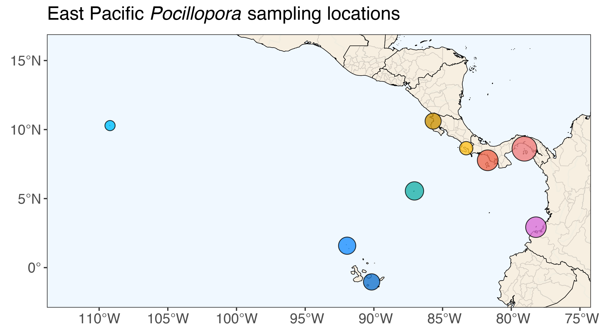

# Eastern Pacific *Pocillopora* genome skimming

This repository contains scripts and RMarkdown documents for the analysis of low-coverage whole genome sequencing (aka genome skimming) data from *Pocillopora* corals in the eastern tropical Pacific region. *Pocillopora* samples were obtained from sites in Panama, Costa Rica, Colombia, Ecuador, and Clipperton Atoll, and were analyzed to determine species lineages, compare population genetics, and identify dominant microbial symbionts.

