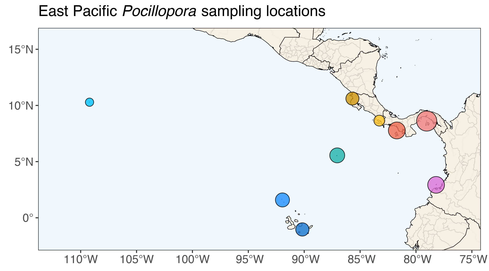
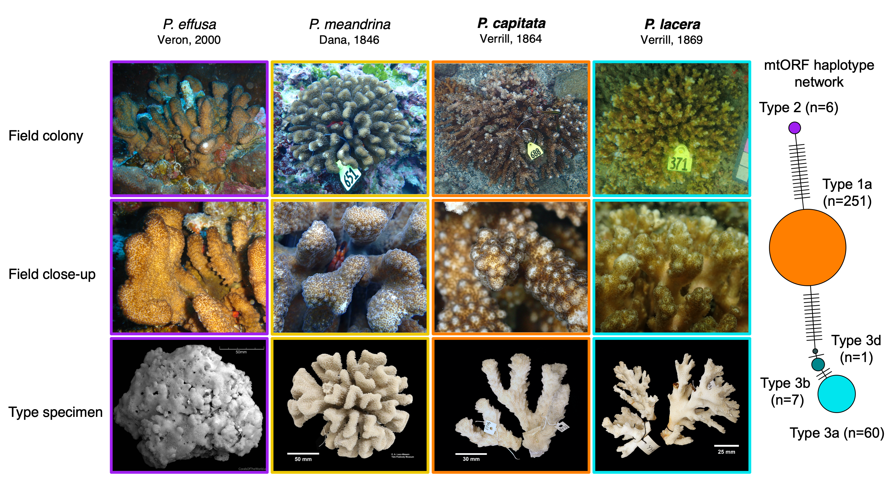

# Eastern Pacific *Pocillopora* genome skimming

This repository contains scripts and RMarkdown documents associated with "Genome skimming illuminates hidden species diversity and Symbiodiniaceae associations in east Pacific Pocillopora corals" in review at *Genome Biology and Evolution*.

*Pocillopora* samples were obtained from sites in Panama, Costa Rica, Colombia, Ecuador, and Clipperton Atoll, and were sequenced using low-coverage whole genome sequencing (aka genome skimming) to determine species lineages, compare population genetics, and identify dominant microbial symbionts. The raw sequencing data is available at [NCBI BioProject PRJNA1055517](https://www.ncbi.nlm.nih.gov/bioproject/?term=PRJNA1055517).

